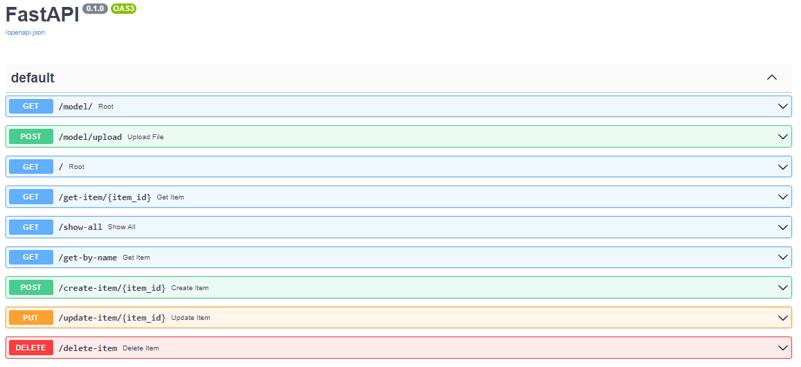

# My API project 

This project was aimed to learning the basics of api using fastapi. One of the advantages of fastapi is that it automatically generates [documentation](#doc) 
The project can be divided into two parts in the first one, the processes of working with json data using the **GET**, **POST**, **PUT** and **DELETE** methods and in the second part, integration a deep neural network in api.
Since the goal was to study the principles of api, and not create a neural network, I used the ready-made network that described [NEURAL TRANSFER USING PYTORCH](https://pytorch.org/tutorials/advanced/neural_style_tutorial.html#neural-transfer-using-pytorch)
A similar project was made for the test using the gredio web interface and uploaded to the [huggingface](https://huggingface.co/spaces/MaksMaib/PetGradioStyleTransf)

## Style transfer example
<p align="center">
+
=

</p>


## Requirements 
* torch==1.11.0+cu113
* torchvision==0.12.0+cu113
* Pillow==9.1.1
* uvicorn==0.17.6
* fastapi==0.78.0
* pydantic==1.9.1

**Note**:
You can install all the python packages you needed by running:
```bash
pip install -r requirements.txt
```


## Start application
```bash
python main.py
```


##
After launching the **main.py**, the application creates a local server with **http://127.0.0.1:8000**  Link [http://127.0.0.1:8000/docs](#doc) contains all the documentation and available endpoints.
<a id = 'doc'> </a>


## Docker 

Docker allows you to create images of a standardized environment for and run these images in containers.
To use docker ([after installation guide](https://docs.nvidia.com/datacenter/cloud-native/container-toolkit/install-guide.html))

### Creating your own image
To create your own image, you need to create a file without an extension. To create your own image, you need to create a 
file without an extension. By default, the filename should be *Dockerfile*
This file contains a set of commands to run when an image creating.
#### Most used commands in dockerfile:
* **FROM** - after this command, we indicate the basic image on which we build our own;
* **RUN _command_** - command that run in a shell;
* **COPY _src dest_** - instruction copies new files or directories from _src_ and adds them to the filesystem of the container at the path _dest_;
* **CMD ["executable","param1","param2"]** - The main purpose of a CMD is to provide defaults for an executing container.

To build an image needs:
```bash
sudo docker build -f Dockerfile-raw -t myapi .
```
_-f Dockerfile-raw_ - The _-f_ parameter indicates that the dockerfile has a non-default name and is named _Dockerfile-raw_. <br /> 
_-t myapi_ - The _-t_ allows  to specify own name _myapi_. By default docker sets random names. <br /> 
_._ - The last parameter sets the directory in which to build the image. _Dot_ mean that is current directory. <br /> 

To run a container needs:
```bash
 sudo docker run --runtime=nvidia -p 8000:8000 myapi
```
* _--runtime=nvidia_ - indicates the need for the image to run the cuda components.
* _-p 8000:8000_ - specifies the connection between the application api host and the container host.
* _myapi_ - The last parameter is the name or id of the image. In my case it is _myapi_.

### Docker-compose (declarative approach) 
Docker сompose allows to build, launch and manage a set of containers at once.
To work with docker-compose, we need to have a file with the extension **.yml** or **.yaml**, which, like the Docker file, contains a set of commands.

#### Most used commands in docker-compose:
* **version: "#"** - set version of docker-compose;
* **services:** - the services described the parameters and components of our container;
* **api** - the name given to my service;
* **container_name:** - allows you to specify a name for the output container;
* **runtime: nvidia** - for cuda usage;
* **build:** - the command needed to build a custom image in docker compose. You must have a Dockerfile;
* **command:** - same as **CMD** in Dockerfile;
* **ports:** - same as ** -p ** in Dockerfile;
